# Hiérarchie & Synthèse des Batailles du T-1000 — Level 8 (Fonderie)

Ce document détaille l'architecture complète, la séquence des phases, les interactions de jauges, les animations jouées et les points d'entrée dans le code pour les combats du **T-1000 (XT100)** dans le **Level 8 (`level8.tscn`)**.

---

## 1. Vue d'Ensemble & Diagramme de Flux Global

```mermaid
flowchart TD
    Start["Départ Level 8 / Pluie Balistique"] --> Bridge["Passage du Pont / Déplacement xfback_04"]
    Bridge --> John["Arrivée Young John Connor (xyjc)\nDestination Atteinte (x=1799)"]
    
    subgraph BF1 ["1ER COMBAT : LE TANK D'AZOTE LIQUIDE (BossTankTarget)"]
        John --> TankDrop["Chute T-1000 du ciel (y: -63 -> 175)"]
        TankDrop --> TankFight["Combat Profil (Walk, Shoot, Smash, Sweep, Roll)"]
        TankFight --> TankAlt["Joueur tire aux missiles sur le Tank"]
        TankAlt --> TankHoles["HitTankEffect : Fuite d'azote liquide (fluid & pool)"]
        TankHoles --> TankBlue["Contact T-1000 avec flaque : Teinte Bleue éclatante"]
        TankBlue --> TankGauge["Jauge 1 : -5% par seconde de contact (GaugeLifeT1000)"]
        TankGauge -->|Jauge 1 = 0%| CrackDefeat["Animation 'crack' (T-1000 gelé et brisé)"]
    end

    CrackDefeat --> Pause1["Interlude 1 : Mise en pause T-1000 & Apparition XT100Big Round 1"]
    
    subgraph BF2 ["2ND COMBAT : LA PASSERELLE & LA CUVE (Boss1SceneLv8 / GaugeLife2ndT100)"]
        Pause1 --> Phase1["PHASE I (100% -> 75%)\nCombat standard profil + Chutes de repositionnement\nChaque cycle PV (5 PV) -> 'blown' -> -5% Jauge 2"]
        Phase1 -->|Jauge 2 <= 75%| Interlude1["INTERLUDE 1 (75%)\nXT100Big Round 1 (Repoussé au fond)"]
        Interlude1 --> Phase2["PHASE II (75% -> 50%)\nChute du ciel au fond (160, 95)\nCharge continue vers l'avant (Y: 95 -> 155)\nRecul au tir (hit -5px / pushed -10px)\nAttaques de mêlée au premier plan"]
        Phase2 -->|Jauge 2 <= 50%| Interlude2["INTERLUDE 2 (50%)\nXT100Big Round 2 (2e round)"]
        Interlude2 --> Phase3["PHASE III (50% -> 25%)\nAnimation 'form' (reconstitution du T-1000)\nReprise combat standard profil"]
        Phase3 -->|Jauge 2 <= 25%| Phase4["PHASE IV (25% -> 0%)\n2e Charge continue sur Y (95 -> 155)\nMême boucle de recul au tir que la Phase II"]
        Phase4 -->|Jauge 2 = 0%| Boiler["PHASE V : FINALE CUVE DE FUSION\nPoussé au centre près de la cuve (160, 95)\nAttente exclusive du tir alternatif / missile"]
        Boiler -->|Tir Alternatif / Missile| SplitDefeat["'Hasta la vista, baby'\nAnimation 'split' -> Chute dans le métal en fusion"]
    end
```



---

## 2. Tableau Comparatif des Deux Combats

| Caractéristique | 1er Combat (Tank d'azote) | 2nd Combat (Passerelle & Cuve) |
|---|---|---|
| **Conteneur Principal** | `BossTankTarget` (`boss_tank_target.gd`) | `Boss1SceneLv8` (`boss_level8.gd` / `foundry_fight.gd`) |
| **Acteur T-1000** | `xt100` (`xt100_enemy.gd`) | `xt100` (`xt100_enemy.gd`) |
| **Jauge de Vie UI** | `GaugeLifeT1000` (Jauge Bleue 1ère phase) | `GaugeLife2ndT100` (Jauge 2e combat) |
| **Mécanique de Dégâts** | Contact avec les flaques d'azote liquide créées par les missiles | Dégâts directs par cycles de 5 PV (`blown` = -5% jauge) et phases de recul |
| **Animation de Fin** | `crack` (gel et éclatement) | `split` (séparation / chute cuve finale) |

---

## 3. Détail des Phases du 2nd Combat (Fonderie)

### 🔹 Phase I : Combat de Profil Standard (100% $\rightarrow$ 75%)
- **Comportement** : Déplacement horizontal de profil (`walk`, `roll`, `foward`), attaques à distance (`shoot`) et au corps-à-corps (`smash`, `sweep`).
- **Cycles de mort** : Chaque fois que ses 5 PV tombent à 0, il joue l'animation `blown` (chute et dissolution), la Jauge 2 perd **5%**, puis il rechute du ciel à un X aléatoire de la passerelle.
- **Déclencheur de transition** : Lorsque la jauge atteint **75%**, le T-1000 se met en pause masquée (`mettre_en_pause_phase()`) et déclenche le premier round de l'interlude `XT100Big`.

### 🔹 Interlude 1 & 2 : Les Assauts de XT100Big
- **Acteur** : `xt100big` (`xt100big.gd`).
- **Round 1 (à 75%)** : Apparition au premier plan, séquences de tirs et de popups jusqu'à être repoussé.
- **Round 2 (à 50%)** : Deuxième round avec résistance accrue.

### 🔹 Phase II : La Charge Continue en Profondeur (75% $\rightarrow$ 50%)
- **Entrée** : Chute depuis le ciel vers le fond de la passerelle $(X=160, Y=95)$.
- **Mécanique de Charge** : Avance continue sur l'axe Y vers le joueur $(Y: 95 \rightarrow 155)$ sans bouger en X.
- **Recul au tir** :
  - Tir standard : recul de $-5\text{ px}$ vers le fond avec animation `hit`.
  - Tir alternatif (missile) : recul de $-10\text{ px}$ vers le fond avec animation `pushed`.
- **Attaques au premier plan** : Une fois arrivé à $Y=155$, il s'arrête (`idle`), exécute une attaque puissante (`smash` ou `sweep`), puis repart du fond.

### 🔹 Phase III : Reconstitution & Combat Standard (50% $\rightarrow$ 25%)
- **Entrée** : Joue l'animation `form` (métal liquide qui se reforme en humanoïde).
- **Comportement** : Reprise de la boucle de combat de profil avec animation `blown` à chaque perte de cycle de PV.

### 🔹 Phase IV : Seconde Charge & Pluie de Shotgun Spécial (25% $\rightarrow$ 0%)
- **Comportement** : Même boucle de charge $Y=95 \rightarrow 155$ et de résistance au tir que la Phase II.
- **Pluie de Shotgun Spécial** : `BallisticTriggerMarker` injecte `xpickup_29_shotgun` avec $1\text{ chance sur } 3$ ($33.3\%$) sur la colonne dédiée (droite).
- **Condition de transition (0%)** : Les tirs standards bloquent la jauge à $1\%$. Seule une munition **Shotgun Spéciale** (`xpickup_29`) permet de vider les derniers PV/pourcents pour atteindre $0\%$ et déclencher la Phase V.

### 🔹 Phase V : Finale Cuve de Fusion & Timer 10s (0%)
- **Positionnement** : Le T-1000 est poussé et immobilisé au centre près de la cuve $(160, 95)$.
- **Timer de 10 secondes** : Un compte à rebours de **10.0 secondes** démarre dès l'entrée en Phase V.
- **Coup de grâce** : Seul un tir avec une **munition spéciale** Shotgun (`est_special == true`) déclenche `jouer_split_defeat()` :
  - Animation `split` ("Hasta la vista, Baby !").
  - Bascule dans le métal en fusion.
  - Défaite définitive du T-1000 et victoire du niveau.
- **Échec / Timeout (10s sans coup de grâce)** :
  - Le T-1000 et la jauge récupèrent **+25%** ($0\% \rightarrow 25\%$).
  - La **Phase IV est relancée** (`demarrer_phase_4()`).
  - Le joueur doit à nouveau récupérer un `xpickup_29` et repousser le T-1000.

---

## 4. Signaux & Points d'Entrée Clés (Code)

```gdscript
# xt100_enemy.gd
signal contact_hittank_effect(en_contact: bool, nb_pools: int) # Connexion à la jauge 1
signal degats_recus(degats: int, est_missile: bool, est_special: bool) # Connexion à la jauge 2
signal cycle_blown_termine(montant_perte: float)               # Déduction 5% jauge 2

func demarrer_phase_2() -> void                                # Lance la charge Phase II
func demarrer_phase_3() -> void                                # Lance form + Phase III
func demarrer_phase_4() -> void                                # Lance la charge Phase IV + pluie spéciale
func declencher_sequence_finale_boiler() -> void               # Phase V + Timer 10s coup de grâce
func jouer_split_defeat() -> void                              # Cinématique finale split
func jouer_crack_defeat() -> void                              # Cinématique fin 1er boss crack
```
